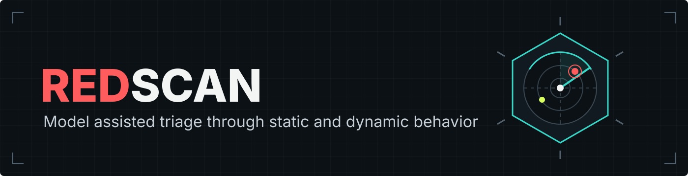
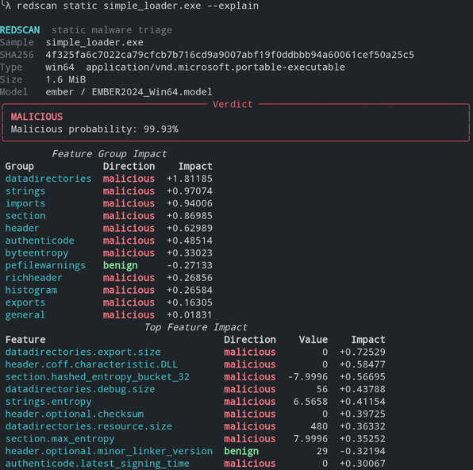

<p align="center">
  
</p>

<p align="center">
  <strong>Score your payload against AI detection before it touches a real target.</strong>
</p>

`redscan` is a local-first CLI for scoring binaries against AI models used for malware classification.
Point it at an implant, loader, or dropper and get results from three three complementary analysis paths: static features, emulated behavior, and a structured LLM assessment.

Example static analysis output:

<p align="left">
  
</p>


## Why redscan?
Signature and heuristic-based scanners already have useful local tools e.g., [DefenderCheck](https://github.com/matterpreter/defendercheck) and [ThreatCheck](https://github.com/rasta-mouse/threatcheck) can bisect a binary to identify bytes that trigger Defender, while [AMSITrigger](https://github.com/RythmStick/AMSITrigger) helps identify strings that trigger AMSI.

The AI detection layer is different. Vendors embed their classifiers in their products but generally don't expose a local scoring interface. The usual alternative is a multi-scanner upload, which can expose the samples to security vendors or other third parties.

Even then, the result is often opaque: you get a score, but not much insight into what caused it. Redscan runs open research models locally and giving you explainable ML signals without sending the sample to a scanning service.

> [!WARNING]
> **A clean score is not clearance.** EMBER and Nebula are open research models that approximate parts of the ML layer of an AV/EDR detection pipeline. The LLM mode is an additional analysis signal, not a substitute for commercial detection.
> Treat all results as one signal in a pre-flight check, alongside a red-team sandbox such as [litterbox](https://github.com/blacksnufkin/litterbox).


## Analysis Modes

| Command | Engine | Model input | 
| --- | --- | --- |
| `static` | EMBER | Local binary features |
| `dynamic` | Nebula + Speakeasy | Normalized emulated behavior |
| `llm` | OpenAI + redump | Parser observations and extracted code |

## Quick Start

Redscan uses [uv](https://docs.astral.sh/uv/). From the project directory:

```bash
uv python install 3.10
uv tool install --python 3.10 .
```

Run a scan with:

```bash
redscan static /path/to/implant.exe
```

Add `--explain` to see which features or behaviors influenced the result, and `--json` for structured output:

```bash
redscan static /path/to/implant.exe --explain --json
```

Run `redscan COMMAND --help` for mode-specific options. If `redscan` is not on your `PATH`, run `uv tool update-shell` and restart your shell.

> [!NOTE]
> A typical assessment can combine all three modes: start with the fast static scan, inspect emulated behavior when needed, and optionally use the LLM mode for a higher-level assessment of extracted code.


## Static Analysis

[EMBER2024](https://github.com/FutureComputing4AI/EMBER2024) extracts local features and picks a
model for PE32, PE64, .NET, APK, ELF, or PDF input.

```bash
# Automatic model selection
redscan static /path/to/implant.exe

# Rank LightGBM TreeSHAP contributions
redscan static /path/to/implant.exe \
  --explain --top-features 12

# Pin an explicit checkpoint
redscan static /path/to/implant.exe \
  --model-path /path/to/EMBER2024_Win64.model
```

Models are cached by default in `~/.redscan/models`. Set `REDSCAN_MODEL_DIR` to specify another folder.

## Dynamic Analysis

[Nebula](https://github.com/dtrizna/nebula) drives
[Speakeasy](https://github.com/mandiant/speakeasy) to emulate a Windows PE, aggregates all entry
points, normalizes the captured behavior, tokenizes it with the bundled BPE tokenizer, and runs the
pretrained transformer locally.

```bash
# Live emulation and prediction
redscan dynamic /path/to/implant.exe

# Explain behavior impacts and keep the normalized model input
redscan dynamic /path/to/implant.exe \
  --explain --top-features 12 \
  --save-report behavior.json

# Replay a saved report instead of emulating again
redscan dynamic /path/to/implant.exe \
  --report behavior.json
```

The bundled config uses a 60-second timeout and a 500 API-call limit. High evasive or complex implants may need more:

```bash
redscan dynamic /path/to/implant.exe \
  --timeout 30 \
  --config /path/to/speakeasy-config.json
```

Without `--config`, Nebula loads `objects/speakeasy_config.json` from its installed package.

> [!Warning]
> Nebula atm has a small context window: the pretrained model considers only the first 512 BPE tokens
> of the normalized behavior report. This can make it susceptible to evasive samples that push
> meaningful behavior beyond that window e.g., a micro sleep loop that makes a high number of
> api calls before performing malicious actions.

## LLM Analysis

This mode uses an LLM as a malware analyst to review decompiled or disassembled code alongside other static features.
Set an [OpenAI](https://platform.openai.com/docs) key and pick any model available to your account.
You can set a default model using `REDSCAN_LLM_MODEL` without specifiying it each time.

```bash
export OPENAI_API_KEY="..."

redscan llm /path/to/sample.exe \
  --model gpt-4o --explain
```

The request carries hashes, headers, section metadata, aggregate string statistics, bounded imports
and exports, signing information, parser warnings, and
[redump](https://github.com/CaptWake/redump) output. Native files use by default radare2 `pdc` decompilation, .NET assemblies use `dncil` disassembly.

You can choose a different analysis backend from the ones supported by redump with `--bin-engine`, or change the binary code representation with `--bin-mode`.

```bash
redscan llm /path/to/sample.exe \
  --bin-engine ida \
  --bin-mode disassemble
```

IDA requires a licensed IDA Pro 9.0+, Hex-Rays for decompilation, and an activated `idalib` module (usually via `py-activate-idalib.py`). Ghidra requires `GHIDRA_INSTALL_DIR`.


### Context strategies

Smaller models may not have enough context to fit all of the decompiled or disassembled code at once, so redscan can automatically split the code into manageable chunks.

| Strategy | Behavior |
| --- | --- |
| `auto` | Use one request if it fits; otherwise chunk the code. |
| `chunk` | Always split the code into chunks. |
| `truncate` | Send only the largest consecutive set of functions that fits. |

auto is the default and usually offers the best balance between cost and code coverage.

### How chunking works

1. redump extracts the code with each function kept as a separate unit.
2. redscan packs the largest consecutive group of complete functions that fits within the model's context window.
3. Functions that are too large to fit on their own are split into segments with continuation markers.
4. Each chunk is sent as a separate request with the sample metadata, redump metadata, chunk index, and code.
5. The model returns structured findings and limitations for each chunk, rather than a separate verdict.
6. redscan combines those findings with the full static analysis for the final classification.
7. If there are too many findings, they are consolidated in batches before the final request.

Chunk requests are independent, so raw code from earlier chunks is never resent.

```bash
redscan llm /path/to/sample.exe --context-strategy auto
```

Redscan tracks context windows for a curated set of OpenAI models. For snapshots, custom, fine-tuned, or newly released models, set the limit explicitly with `--context-window TOKENS`.

## Explainability

`--explain` shows which evidence influenced the score, so a flagged build gives you something concrete to inspect instead of just a detection score number.

| Backend | Method | Interpretation |
| --- | --- | --- |
| `ember` | [LightGBM](https://github.com/microsoft/LightGBM) TreeSHAP | Raw-score contribution per static feature |
| `nebula` | Local input ablation | Probability delta after removing a behavior or group |
| `llm` | Structured evidence assessment | Model-selected indicators with direction and rationale |
